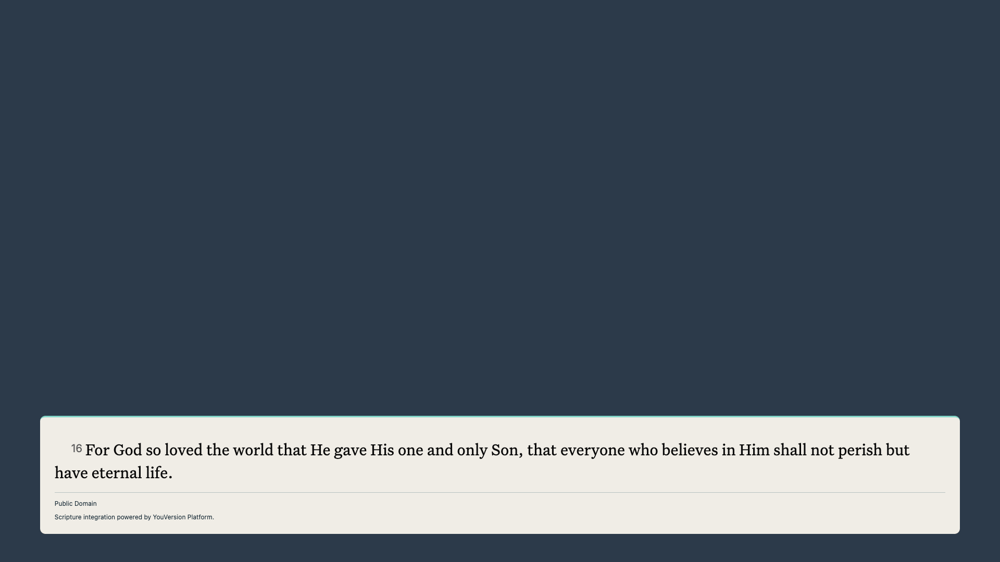
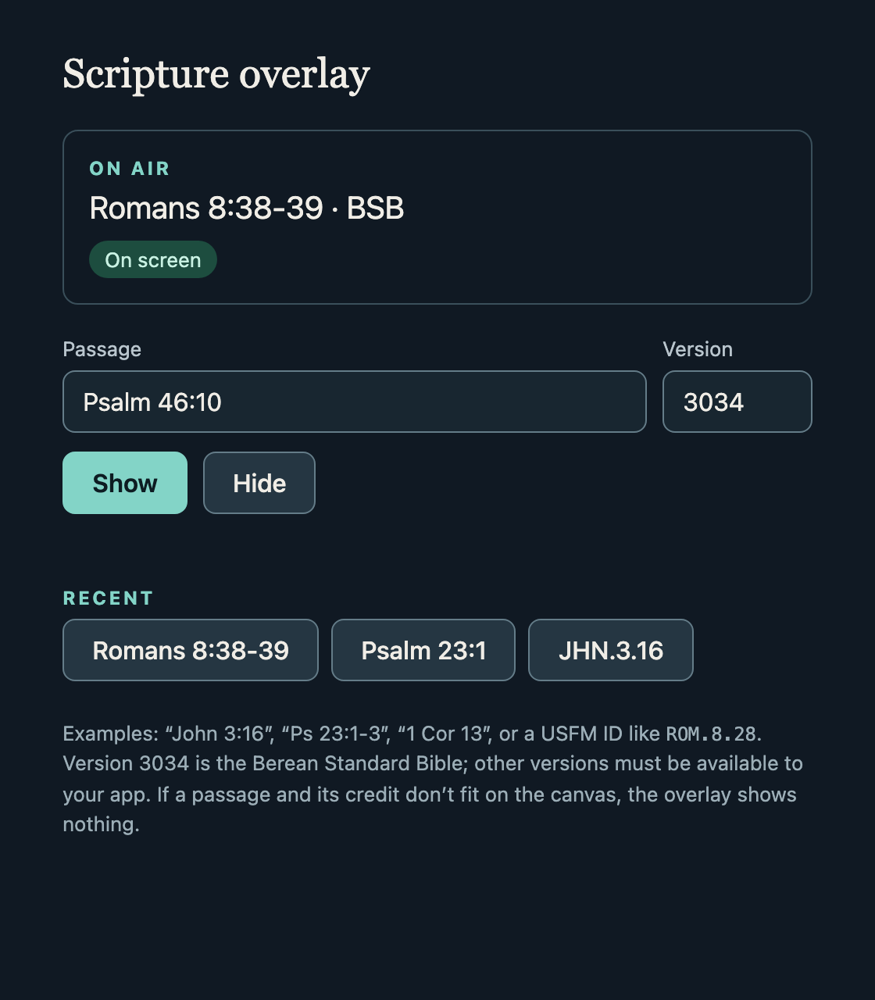
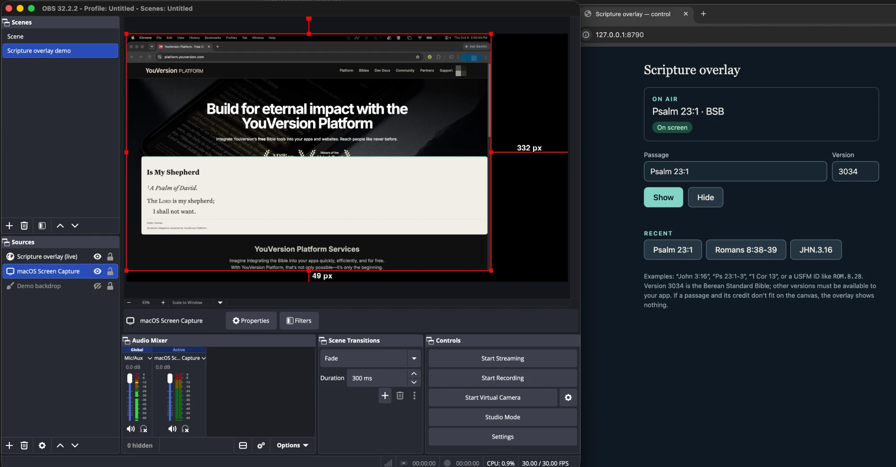

# Scripture overlay for OBS and beyond: a YouVersion Platform example



*OBS 32.2.2 program output at 1920×1080. The backdrop is a colour source standing in
for a camera feed. The overlay is this repository's `live.html`, rendering John 3:16
in the Berean Standard Bible (public domain) exactly as the Platform supplied it.*

A small, dependency-free web page that shows an operator-chosen Bible passage from
the [YouVersion Platform](https://platform.youversion.com) on a transparent lower
third, with the publisher's attribution. It's built and tested as an
[OBS Studio](https://obsproject.com) **Browser Source**, but it's an ordinary web
page: anything that can show a web page, ideally with transparency, can use it (see
[Beyond OBS](#beyond-obs)). It gets out of the way when it should:

- **It never cuts text or credit off.** If the passage and its attribution do not
  fit completely inside the canvas, nothing is shown.
- **It never shows text without attribution.** Missing credit, a failed request, a
  timeout or a missing stylesheet clears the display instead.
- **It renders the Platform's markup unchanged**, with the Platform's Bible CSS and
  the intended Untitled Serif typeface.

This is an independent example. It is not an official YouVersion product.

## Why this is an interesting example

A broadcast overlay breaks several assumptions a normal web reader can make:

| Web reader assumption | OBS Browser Source reality | What this example does |
|---|---|---|
| The page scrolls | The canvas is a fixed size; overflow is invisible | Measures the panel and refuses to show anything that does not fit |
| The page has a background | The page is composited over video | Transparent canvas; only the panel is opaque |
| The reader can click and type | Viewers can't; the operator rarely can | Operator keys through OBS **Interact**, or a `#show` URL hash |
| A stale request just finishes late | A late result would pop onto a live stream | One display generation; hide, timeout and newer selections cancel older ones |
| Fonts and CSS are the host's choice | The Platform specifies Bible CSS and a typeface | Loads the SDK's stylesheets; host styles never override them |
| Errors can be shown | Raw errors on stream are a leak | Fixed, content-free status text only |

## Beyond OBS

The overlay is a web page on a transparent background, and the control page drives
every copy that is open. So it fits anywhere a web page can be layered or shown:

| Where | How | Status |
|---|---|---|
| OBS Studio | Browser Source, `live.html#control` | Tested (OBS 32.2.2, macOS) |
| Other streaming and production tools with a browser or web source | Point the source at the same URL; check that it keeps transparency | Should work; not tested here |
| A projector or TV in a room | Open `live.html#control` full-screen in any browser | Should work; the background is transparent, so the browser shows its default colour behind the panel |
| Wall displays and dashboards that embed web pages | Embed the same URL | Should work; not tested here |
| Your own web app | Reuse `platform-adapter.mjs`, `display-contract.js`, `controller.js` and `view.js` | The core has no OBS dependency |

Wherever it runs, the same rules hold: it shows the whole passage and its credit or
nothing, and it never changes the text. Size the page to the area people actually
see. Video-call apps generally can't layer a web page over your camera; share a
browser window instead.

## Requirements

- [OBS Studio](https://obsproject.com) 28 or newer (tested with 32.2.2 on macOS)
- Node.js 22+ for the tests and the live server
- For real passages: a YouVersion Platform app and its App Key from
  [platform.youversion.com](https://platform.youversion.com), with access to the
  Bible version you choose
- Google Chrome, only for the automated browser tests

## Try it without a key

The synthetic pages contain no Scripture and make no network requests.

1. Open `index.html` in a desktop browser. This is the inspection page: try each
   button, including **Try overflow** and **Missing attribution**.
2. In OBS, add a **Browser** source, tick **Local file**, choose `output.html`, and
   set width and height to your canvas (1280×720 or 1920×1080).
3. Right-click the source → **Interact**. Press **1** to show the demo, **8** for a
   right-to-left sample, **2** to see overflow refused, and **Esc** to hide.

To start a fixture on load, untick **Local file** and use
`http://absolute/<full path>/output.html#short`. That is how OBS serves local files;
it will not load `file://` URLs typed into the URL field.

## Show a real passage



1. Install the pinned SDK once: `cd sdk-check && npm ci`.
2. Start the live server with your key:

   ```bash
   cd sdk-check
   YVP_APP_KEY=<your app key> node serve-live.mjs 8790
   ```

   It prints two addresses.
3. In OBS, add a Browser source with the URL `http://127.0.0.1:8790/live.html#control`
   at your canvas size.
4. Open the **control page**, `http://127.0.0.1:8790/`, in your normal browser (not in
   OBS). Type a passage such as `Psalm 23:1`, `1 Cor 13:4-7` or `ROM.8.28`, and
   press **Show**. The overlay changes within a second. **Hide** clears it, and
   **Recent** brings back an earlier passage with one click.

The control page reports what viewers actually see: **On screen**, **Too long for
the canvas** (nothing is shown; pick a shorter passage), or **No overlay
connected**. If a passage can't be loaded, the current one stays up and the page
says why. The server starts with the passage named on `live.html`'s `<body>`, and
caps Platform requests at one per second and 120 per hour.

The browser calls no Platform APIs itself, but it does load the SDK's font
stylesheet, whose URL contains your App Key (see
[the operator guide](docs/operator-guide.md)). The control server listens only on
this computer and refuses requests from other websites.



*The overlay running for real: OBS (left) shows Psalm 23:1 over a screen capture,
and the control page (right) reports it **On screen**. Personal browser details in
the capture are pixelated.*

For a single fixed passage without a control page, use `live.html#show`.

## How it works

```text
control page ──Show "Psalm 23:1"──▶ control server ──SDK──▶ YouVersion Platform
      ▲                                  │                 (passage HTML, attribution, stylesheets)
      │                                  │ change event
  "On screen" ◀── status ── live.html in OBS ──▶ validate ──▶ load CSS/fonts ──▶ measure ──▶ show or refuse
```

| File | Responsibility |
|---|---|
| `platform-adapter.mjs` | Operator-configured selections only, rate-capped SDK calls, no retries or cache, content-free errors |
| `display-contract.js` | Validates the SDK display model (HTML, attribution, stylesheets, container attributes); never truncates |
| `controller.js` | One display at a time; deadline across load, CSS, fonts and layout; hide and supersede |
| `view.js` | Inserts the SDK's HTML and attributes, loads its stylesheets, measures hidden, reveals only if it fits on screen |
| `mount.mjs` | Browser wiring: exact stylesheet origins, hide on resize/visibility/font changes, disposal |
| `overlay.css` | Panel layout; host fixture styles sit in a low-priority CSS layer so the SDK's Bible CSS always wins |
| `output.html` / `live.html` | OBS pages: synthetic fixtures / live passage (`#control` follows the control page), with reviewed CSPs |
| `control-server.mjs` | Loopback control server: passage on air, Server-Sent Events to overlays, request caps, cross-site and host guards |
| `control.html` / `control.js` | Operator control page: type a reference, Show/Hide, recent passages, live on-screen status |
| `reference.js` | Everyday references (“1 Cor 13:4-7”) to USFM passage IDs; refuses anything ambiguous |
| `demo.js` / `index.html` | Synthetic, clearly labelled fixtures and the inspection page |
| `sdk-check/` | Pinned `@youversion/platform-core`; offline compatibility tests, live and control acceptance, `serve-live.mjs` |

## Tests

```bash
node --test *.test.*                       # unit tests, nothing to install
node browser-acceptance.mjs                # real headless Chrome, 4 sizes, both pages
cd sdk-check && npm ci && npm test         # real SDK display model, offline (stubbed fetch)
```

With a key and OBS running:

```bash
cd sdk-check && YVP_APP_KEY=… node live-acceptance.mjs        # real passage in Chrome
cd sdk-check && YVP_APP_KEY=… node control-acceptance.mjs     # show, switch, refuse, hide via the control server
OBS_WS_PASSWORD=… YVP_APP_KEY=… node obs-acceptance.mjs       # real OBS, via obs-websocket
```

`obs-acceptance.mjs` builds a temporary scene, decodes OBS's own render of the
source pixel by pixel, and removes the scene afterwards. It checks transparency,
that the panel is drawn, that overflow leaves the canvas empty, and the live
passage. What was verified, and with which versions, is in
[docs/verification.md](docs/verification.md).

## Things to know

- **Keep the source size equal to what you show.** OBS cropping and scaling happen
  after the page measures itself, so a cropped source can hide a credit the page
  believes is visible.
- **The Bible CSS imports Google Fonts**, so viewers' browsers contact
  `fonts.googleapis.com` and `fonts.gstatic.com`.
- **If every Browser Source is blank** (even other websites), restart OBS with at
  least one Browser Source saved in a scene. On macOS we saw sources created over
  obs-websocket stay blank when none existed at launch.
- **The control page is for this computer only.** The server listens on
  `127.0.0.1` and refuses requests from other websites and host names. Anyone using
  this computer can change what is on air, so don't leave it running unattended.
- **Rights are your responsibility.** A successful API response does not settle
  whether you may stream, record or archive a translation. Check the Platform
  terms and the publisher's license for your use.

## License

The code is [MIT](LICENSE). It conveys no rights to Bible text, publisher
attribution, YouVersion fonts or Platform CSS, which you load at runtime under
your own Platform agreement. The screenshot in `docs/` shows the Berean Standard
Bible, which is in the public domain.
